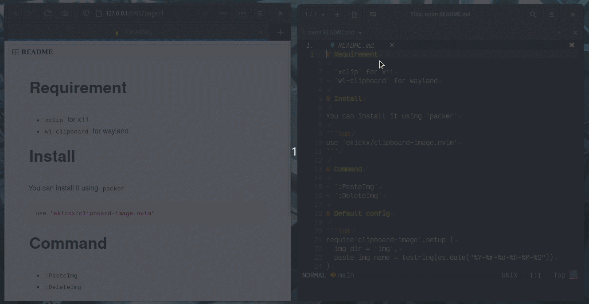

# Requirement

This plugin currently only supports Windows and Linux.

On Linux, you will need:

- `xclip` for x11
- `wl-clipboard` for wayland

# Install

You can install it using [vim-plug](https://github.com/junegunn/vim-plug)

```vim
Plug 'ekickx/clipboard-image.nvim'
```

or [packer.nvim](https://github.com/wbthomason/packer.nvim)

```lua
use 'ekickx/clipboard-image.nvim'
```

# Use

- `:PasteImg` or `:lua require'clipboard-image.paste'.paste_img()`

# Config

## Default config

After the plugin installed, you can already use it without configuring it.

The default config is like this:

```lua
require'clipboard-image'.setup {
  img_dir = 'img',
  img_dir_txt = 'img',
  img_name = function () return os.date('%Y-%m-%d-%H-%M-%S') end,
  affix = '%s'
}
```

## Config example

For example, I use [11ty](https://www.11ty.dev/) to generate a static site from my markdown. I want to save my image on `src/assets/img` And instead of based on date, I want my image's name to be `image1`, `image2`, etc. But I want the pasted text to be `/assets/img/image1` instead of `src/assets/img/image1`. So the config will be like this:

```lua
require'clipboard-image'.setup {
  img_dir = 'src/assets/img',
  img_dir_txt = '/assets/img',
  img_name = function ()
    local img_dir = require'clipboard-image'.get_config().img_dir()
    local index = 1
    for output in io.popen('ls '..img_dir):lines() do
      if output == 'image'..index..'.png' then
        index = index + 1
      else
        break
      end
    end
    return 'image'..index
  end,
  affix = '',
}
```


